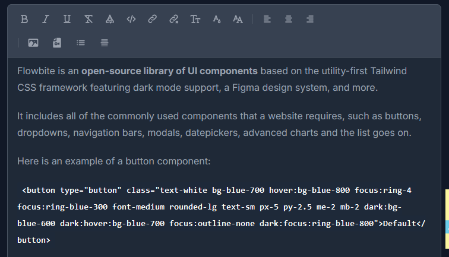

# Inspire & Ink 


## Project Description

**Inspire & Ink** is a modern blogging platform built using Django Rest Framework (DRF) for the backend and Vue.js for the frontend. It offers seamless content creation and management with a user-friendly interface and secure authentication. The platform supports rich text content using a WYSIWYG editor, enabling users to write and format articles easily while storing content as HTML.

---

## Features

### 1. Authentication
- User authentication using **Djoser** and **JWT** (JSON Web Tokens) for secure access.
- Registration, login, and password reset functionality.

### 2. Content Creation
- **Rich text editor (WYSIWYG)** for writing articles with HTML content storage.




- Create, update, delete, and view article posts.

### 3. Frontend Design
- Built with **Vue.js**, providing a responsive and dynamic user interface.
- Styled using **Tailwind CSS** and **Flowbite** for a modern and consistent design.

### 4. Backend Functionality
- **RESTful API** built using Django Rest Framework (DRF).
- Well-structured endpoints for managing article posts and user profiles.

### 5. Secure Content Management
- **Role-based permissions** to manage users and restrict access.
- Secure storage of content with token-based authentication.

---

## Technologies Used

### Backend:
- Django
- Django Rest Framework (DRF)
- Djoser (for user management and authentication)
- JWT (for secure token-based authentication)

### Frontend:
- Vue.js 3
- Tailwind CSS
- Flowbite (UI components and design)
- Axios (for API requests)
- WYSIWYG Editor (for article content)

---

## Installation

### Backend Setup:

1. Clone the repository:
   ```bash
   git clone https://github.com/Ahmed-Nagi1/Inspire-Ink
   cd ./backend
   ```


2. Create and activate a virtual environment:

```
python -m venv env
source env/bin/activate
# On Windows: env\Scripts\activate
```


3. Install dependencies:

`pip install -r requirements.txt`


4. Apply database migrations:

```
python manage.py makemigrations
python manage.py migrate
```


5. Run the development server:

`python manage.py runserver`


### Frontend Setup:

1. Navigate to the frontend directory:

`cd ./frontend`


2. Follow the instructions in the README.md file for further setup.


---

Usage

1. Access the frontend at http://localhost:3000 (or the port specified by Vue.js).


2. API endpoints are available at http://127.0.0.1:8000/.


3. Register a new user or log in to access content creation features.


4. Use the rich text editor to create and format article posts.
